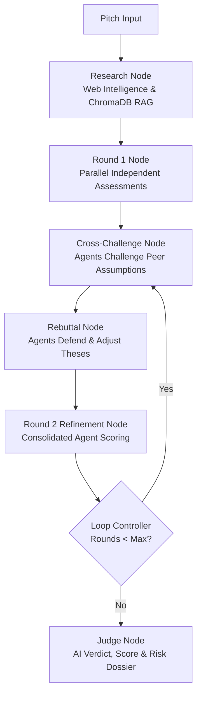

<div align="center">

# ⚖️ Devil's Advocate Panel

[](LICENSE)
[](https://www.python.org/)
[](https://nodejs.org/)
[](https://react.dev/)
[](https://fastapi.tiangolo.com/)
[](https://langchain-ai.github.io/langgraph/)
[](https://github.com/Dineshs2004offcial/devils-advocate-panel/actions)

**An adversarial multi-agent AI system that simulates an elite Venture Capital investment committee to stress-test startup pitches, audit financial unit economics, and synthesize objective investment verdicts.**

[Quick Start](#-quick-start) • [Why I Built This](#-why-i-built-this) • [Sample Verdict](#-sample-pitch--verdict-example) • [Architecture](#-system-architecture) • [MCP Connectors](#-mcp-connectors)

---

<!-- DEMO MEDIA PLACEHOLDER -->
```
+-----------------------------------------------------------------------------------+
|                                                                                   |
|                   [ 🎬 DEMO SCREENSHOT / ANIMATED PREVIEW ]                       |
|                                                                                   |
|       Interactive React 19 Dashboard: Live Agent Debate, Cross-Examination,       |
|            ChromaDB RAG Benchmarks, and AI Judge Score Breakdown (0-100)          |
|                                                                                   |
+-----------------------------------------------------------------------------------+
```
*(Drop `assets/demo.gif` or `assets/dashboard.png` here to preview the live panel in action)*

---

</div>

## 💡 Why I Built This

Most startup pitch feedback suffers from confirmation bias and lacks rigorous, multidisciplinary scrutiny before founders step into high-stakes investor meetings. I built the **Devil's Advocate Panel** to simulate an adversarial VC investment committee where specialized autonomous agents debate defensibility, audit unit economics, and challenge market assumptions. By combining **LangGraph** multi-agent state loops, **ChromaDB RAG** industry benchmarks, and **Model Context Protocol (MCP)** tools, the system delivers an unbiased, scored investment verdict in seconds.

---

## ⚡ Quick Start

### Prerequisites
* **Python**: 3.10+
* **Node.js**: 18+ & npm 9+
* **PostgreSQL** *(Optional)*: Persistent storage fallback to in-memory mode if omitted
* **At least ONE LLM API Key**: Groq (recommended for speed), Google Gemini, OpenAI, or OpenRouter

---

### 1. Clone & Configure Environment

```bash
git clone https://github.com/Dineshs2004offcial/devils-advocate-panel.git
cd devils-advocate-panel

# Copy example environment file
cp .env.example .env
```
*(Open `.env` and add at least one API key, such as `GROQ_API_KEY` or `GEMINI_API_KEY`)*

---

### 2. Run Backend (FastAPI)

```bash
# Set up Python virtual environment
python -m venv venv

# Activate virtual environment
# Windows (PowerShell):
.\venv\Scripts\activate
# Linux / macOS:
source venv/bin/activate

# Install dependencies
pip install -r backend/requirements.txt

# Start FastAPI server
python -m uvicorn backend.app.main:app --reload --port 8000
```
* **API Documentation**: [http://localhost:8000/docs](http://localhost:8000/docs)

---

### 3. Run Frontend (React 19 + Vite)

```bash
# In a new terminal window
cd frontend
npm install
npm run dev
```
* **Dashboard App**: [http://localhost:5173](http://localhost:5173)

---

### 🐳 Optional: Run with Docker Compose

```bash
docker-compose up --build
```

---

## 📊 Sample Pitch & Verdict Example

### Pitch Submission
```json
{
  "startup_name": "HealthSync AI",
  "problem": "Hospital scheduling inefficiencies and high radiologist burnout",
  "solution": "Autonomous AI triaging and clinical schedule optimization platform",
  "target_market": "Tier 1 hospital networks & radiology clinics",
  "business_model": "B2B annual SaaS subscription per department ($48k/yr)",
  "funding_amount": 750000
}
```

### Generated Committee Output & AI Judge Verdict

```markdown
═════════════════════════════════════════════════════════════════════════════════
  AI JUDGE VERDICT: REVIEW  |  FINAL SCORE: 74 / 100  |  CONFIDENCE: 88%
═════════════════════════════════════════════════════════════════════════════════

⚖️ Executive Summary:
HealthSync AI addresses a verified high-friction pain point with strong willingness-
to-pay in enterprise healthcare. However, the committee flags significant customer
acquisition friction and incumbent EHR vendor integration moats.

🔍 Agent Committee Debate Highlights:
• Skeptical VC: "High risk of Epic/Cerner launching native scheduling modules within
  12 months, wiping out standalone point solutions."
• Financial Analyst: "Healthy gross margin potential (82%), but sales cycle length
  (9-14 months) requires higher capital cushion than $750k ask."
• Market Realist: "Radiology TAM is $3.2B with 22% CAGR; high switching costs once
  onboarded protect long-term retention."

🛡️ Key Strengths:
  [+] High average contract value ($48k ACV) with clear ROI metric for hospital CFOs.
  [+] Deep workflow integration creates defensible switching barriers post-deployment.

⚠️ Critical Vulnerabilities:
  [-] Capital insufficiency: $750k funding is dangerously lean for enterprise healthcare sales cycles.
  [-] Regulatory & compliance friction (HIPAA / BAA certification overhead).

🎯 Actionable Recommendations:
  1. Increase seed round target to $1.5M to ensure 18 months of runway through 12-month enterprise POCs.
  2. Secure 2 signed hospital LOIs before institutional deployment.
```

---

## 🏗️ System Architecture

```text
                               ┌───────────────────────────┐
                               │ React 19 + Vite Dashboard │
                               │ (Tailored Dark Glass UI)  │
                               └─────────────┬─────────────┘
                                             │ REST API / SSE
                                             ▼
                               ┌───────────────────────────┐
                               │      FastAPI Backend      │
                               └─────────────┬─────────────┘
                                             │
                                             ▼
                               ┌───────────────────────────┐
                               │  LangGraph Debate Engine  │
                               └─────────────┬─────────────┘
                                             │
          ┌──────────────────────────────────┼──────────────────────────────────┐
          │                                  │                                  │
          ▼                                  ▼                                  ▼
 ┌─────────────────┐                ┌──────────────────┐               ┌─────────────────┐
 │ Web Research MCP│                │  ChromaDB RAG    │               │  PostgreSQL DB  │
 │  (Tavily / DDG) │                │ (Vector Storage) │               │ (Session Store) │
 └─────────────────┘                └──────────────────┘               └─────────────────┘
```

---

## 🔄 Multi-Agent LangGraph Debate Pipeline

The core evaluation runs through a stateful multi-round debate graph built on **LangGraph**:



### Agent Personas
1. **VC / Skeptical Agent**: Identifies valuation red flags, defensibility deficits, platform risk, and capital efficiency issues.
2. **Financial Analyst Agent**: Audits unit economics, CAC/LTV dynamics, gross margins, cash burn rate, and financial sustainability.
3. **Market Realist Agent**: Evaluates TAM/SAM/SOM, market saturation, incumbent moats, customer acquisition friction, and regulatory hurdles.
4. **AI Judge / Final Evaluator**: Weighs cross-agent debate, web research, and RAG data to render an objective verdict with dynamic scoring (0–100) and actionable recommendations.

---

## 🔌 MCP Connectors

The backend integrates the **Model Context Protocol (MCP)** standard for standardized agent tool orchestration:

| Connector | Technology | Purpose |
| :--- | :--- | :--- |
| **Web Research MCP** | Tavily API / DuckDuckGo | Real-time market sizing, competitor discovery, and news sentiment |
| **Knowledge Base MCP** | ChromaDB & MiniLM-L6-v2 | Vector similarity search against benchmark startup business models |
| **PostgreSQL MCP** | SQLAlchemy / pg8000 | Structured persistence of pitch histories, transcripts, and session metrics |
| **Executive Report MCP** | Native Exporter | Multi-format export (PDF, HTML, Markdown) of executive panel dossiers |

---

## 🤖 Multi-Tier LLM Routing & Fallback

To guarantee high availability and sub-second agent turns, the system executes an automated failover chain:

$$\text{Groq (LLaMA 3.3 70B)} \longrightarrow \text{Gemini (Flash)} \longrightarrow \text{OpenAI (GPT-4o)} \longrightarrow \text{OpenRouter} \longrightarrow \text{Structured Fallback}$$

* **Groq (LLaMA 3.3 70B)**: Ultra-low latency (<500ms) execution for multi-turn debate rounds.
* **Google Gemini (Gemini 1.5/3.6 Flash)**: Large context handling for multi-document RAG and web research synthesis.
* **OpenAI (GPT-4o / GPT-4o-mini)**: High-precision structured output and JSON schema validation for judge verdicts.
* **Zero-Failure Fallback**: In the event of network disconnection or absent keys, heuristic rule engines maintain application integrity.

---

## ⚙️ Environment Variables Reference

Configure these in your `.env` file (see [`.env.example`](.env.example)):

| Variable | Status | Default | Description |
| :--- | :---: | :--- | :--- |
| `GROQ_API_KEY` | **Recommended** | `""` | Primary key for fast LLaMA 3.3 agent execution |
| `GEMINI_API_KEY` / `GOOGLE_API_KEY` | **Recommended** | `""` | Key for Google Gemini RAG and market synthesis |
| `OPENAI_API_KEY` | Optional | `""` | Key for OpenAI GPT-4o verdict synthesis |
| `MISTRAL_API_KEY` | Optional | `""` | Key for Mistral AI provider routing |
| `OPENROUTER_API_KEY` | Optional | `""` | OpenRouter gateway key for open-source model fallback |
| `TAVILY_API_KEY` | Optional | `""` | Tavily API key for live web research MCP |
| `DATABASE_URL` | Optional | Memory Fallback | PostgreSQL connection string (`postgresql+pg8000://...`) |
| `CHROMA_PERSIST_DIR` | Optional | `./data/chroma_db` | Storage path for ChromaDB vector embeddings |
| `EMBEDDING_MODEL` | Optional | `sentence-transformers/all-MiniLM-L6-v2` | Embedding model for RAG vectorization |

---

## 📂 Project Structure

```text
devils_advocate_panel/
├── .env.example            # Annotated template for environment variables
├── .github/workflows/      # GitHub Actions CI/CD automation
│   └── tests.yml           # Pytest continuous integration workflow
├── Dockerfile              # Container deployment specification
├── docker-compose.yml      # Multi-container orchestration (DB + Backend + Frontend)
├── pytest.ini              # Pytest environment & path configuration
├── requirements.txt        # Root Python dependencies
├── streamlit_app.py        # Lightweight backup Streamlit interface
├── tests/                  # Backend unit & integration test suite
│
├── backend/                # FastAPI Application
│   ├── requirements.txt    # Backend Python package requirements
│   └── app/
│       ├── main.py         # FastAPI entrypoint & CORS middleware
│       ├── ai_service.py   # Multi-provider LLM failover router
│       ├── agents/         # VC, Financial, Market, and Judge agents
│       ├── graph/          # LangGraph state machine & debate nodes
│       ├── llm/            # Provider factory (Groq, Gemini, OpenAI, Mistral)
│       ├── mcp/            # Model Context Protocol servers & clients
│       ├── rag/            # ChromaDB ingestion & vector retrieval
│       ├── routes/         # REST API endpoints (evaluation, pitch, user)
│       └── schemas/        # Pydantic data schemas
│
└── frontend/               # React 19 + Vite Application
    ├── package.json        # Frontend dependencies & scripts
    ├── vite.config.js      # Vite build configuration
    └── src/
        ├── App.jsx         # Root dashboard view
        ├── index.css       # Design tokens & glassmorphism theme
        ├── components/     # UI components (AgentPanelGrid, ScoreDashboard, etc.)
        └── pages/          # Executive dashboard views
```

---

## 🧪 Testing

Run backend unit and integration tests:

```bash
# Run test suite
pytest tests/ -v
```

---

## 📄 License

Distributed under the MIT License. See [`LICENSE`](LICENSE) for details.
